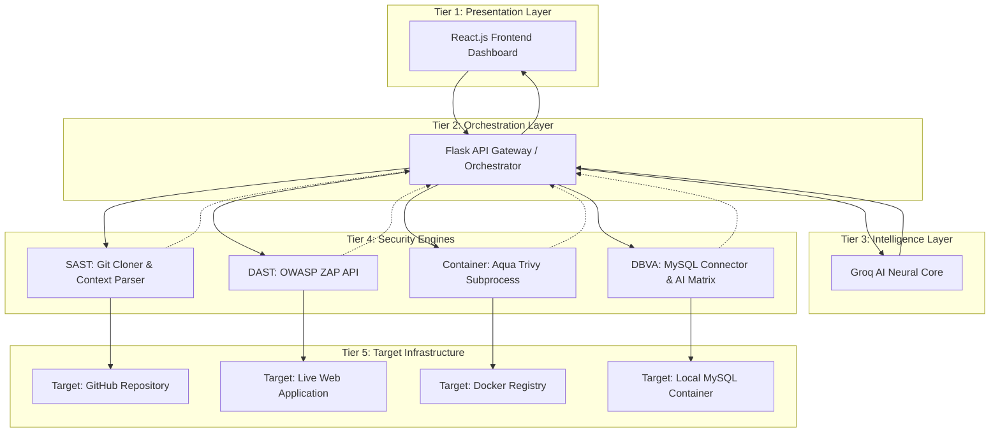

<div align="center">
  
</div>

# 🛡️ NexusSec: Enterprise DevSecOps & VAPT Platform


**NexusSec** is a comprehensive, automated Vulnerability Assessment and Penetration Testing (VAPT) platform. Designed as a modern DevSecOps control center, it bridges the gap between deterministic infrastructure auditing and generative AI threat remediation, providing security teams with a unified dashboard to manage risk across code, web apps, containers, and databases.

---

## 📑 Table of Contents
1. [Platform Overview](#-platform-overview)
2. [Security Engines & Scanners](#-security-engines--scanners)
3. [Role-Based Access Control (RBAC)](#-role-based-access-control-rbac)
4. [System Architecture](#-system-architecture)
5. [Technology Stack](#-technology-stack)
6. [Installation & Setup](#-getting-started)
7. [Ethical Disclaimer](#-ethical-use--disclaimer)

---

## 🚀 Platform Overview

NexusSec centralizes multi-cloud and application security into a single pane of glass. It features a heuristic trend engine that tracks vulnerability mitigation over time, a dynamic GRC (Governance, Risk, and Compliance) matrix, and an integrated **Neural Core** that utilizes Llama-3.3 to auto-generate remediation patches and weaponized Red Team Proof of Concepts (PoCs).

<div align="center">
  
  <p><em>Nexus-Red Neural Core generating dynamic exploit payloads and remediation scripts.</em></p>
</div>

---

## ⚙️ Security Engines & Scanners

NexusSec utilizes a hybrid scanning architecture, combining deterministic rule-based checks with live offensive fuzzing.

| Engine Module | Target Infrastructure | Core Technology | Assessment Strategy |
| :--- | :--- | :--- | :--- |
| **SAST (Source)** | GitHub Repositories | Python AST / Regex | Static secret scanning & deep contextual code parsing. |
| **DAST (Web)** | Live Web Applications | OWASP ZAP (Python API) | Active HTTP fuzzing, AJAX spidering, and payload injection. |
| **Container Ops** | Public Docker Registries & IaC | Aqua Trivy | OS-level CVE extraction & Dockerfile misconfiguration checks. |
| **DBVA (Infrastructure)** | MySQL, PostgreSQL, Oracle | `mysql.connector` & Groq AI | **Hybrid:** Live deterministic MySQL querying + AI Predictive Threat Modeling for enterprise databases. |

---

## 🔐 Role-Based Access Control (RBAC)

To enforce strict Separation of Duties (SoD), NexusSec features an IAM gateway that restricts module access based on the authenticated user's profile.

| User Profile | Access Level | Authorized Capabilities | Restricted Actions |
| :--- | :--- | :--- | :--- |
| **DevSecOps Admin** | `Full Access` | Execute all scanners, approve/deny risk exceptions, view Immutable Ledger, generate Red Team PoCs. | None. |
| **Developer** | `Scope-Limited` | Execute SAST, DAST, and Container scans. Request risk exceptions, use AI Auto-Fix. | Cannot view GRC Dashboard, cannot run Database Infrastructure audits, cannot generate Red Team PoCs. |
| **Compliance Auditor** | `Read-Only` | View Dashboard KPI metrics, GRC mapping, and Immutable Compliance Ledger. | Cannot execute active scans, view source code, or modify platform state. |

<div align="center">
  
</div>

---

## 🏗️ System Architecture

NexusSec operates on a decoupled, microservices-oriented architecture, strictly separating the Presentation Layer from the Orchestration API and Security Engines.



---

## 💻 Technology Stack

| Category | Technologies Used |
| :--- | :--- |
| **Frontend UI** | React.js, Tailwind CSS, Framer Motion, Recharts |
| **Backend API** | Python, Flask, Flask-CORS |
| **Security Integrations** | OWASP ZAP, Aqua Trivy, mysql-connector-python |
| **AI / Machine Learning** | Groq API, Meta Llama-3.3-70b |
| **Infrastructure / DevOps** | Docker, Docker-Compose |

---

## 🏁 Getting Started

### Prerequisites

- Node.js (v16+) & npm  
- Python (v3.9+) & pip  
- Docker Desktop  
- OWASP ZAP (Port 8080)  
- Aqua Trivy  

---

### 1. Clone the Repository

```bash
git clone https://github.com/yourusername/NexusSec.git
cd NexusSec
```

---

### 2. Environment Variables

Create `.env` inside `server/`:

```env
GROQ_API_KEY=your_groq_api_key_here
GITHUB_CLIENT_ID=your_github_oauth_id
GITHUB_CLIENT_SECRET=your_github_oauth_secret
```

---

### 3. Backend Setup

```bash
cd server
python -m venv venv
source venv/bin/activate
pip install -r requirements.txt
python app.py
```

Runs on: `http://localhost:5000`

---

### 4. Frontend Setup

```bash
cd client
npm install
npm start
```

Runs on: `http://localhost:3000`

---

### 5. DBVA Testing Setup

```bash
cd target-environments/mysql-vuln
docker-compose up -d
```

Target: `localhost:3306`

---

## ⚠️ Ethical Use & Disclaimer

This tool includes active offensive security testing features.

**Use only with proper authorization.**  
Developers assume **no liability** for misuse.

---

*Developed as a B.Tech Capstone Project focusing on Enterprise Security Architecture & Applied Generative AI.*
