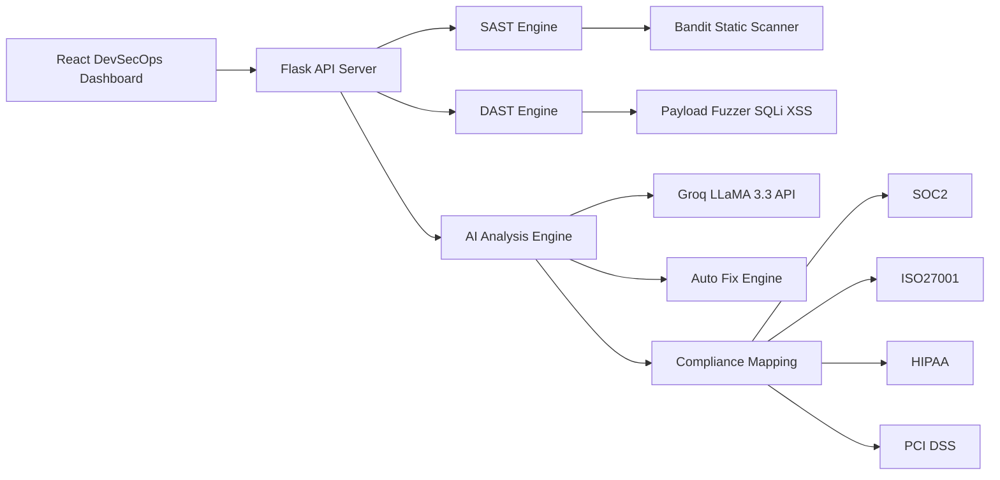

# 🛡️ NexusSec

## Enterprise-Grade DevSecOps & Vulnerability Assessment Platform


---

# 📌 Overview

**NexusSec (Sentinel V2)** is an AI-driven **DevSecOps Vulnerability Assessment Platform** that bridges the gap between **deep technical security scanning and executive-level compliance reporting**.

The platform orchestrates multiple security analysis pipelines including:

* **SAST (Static Application Security Testing)**
* **DAST (Dynamic Application Security Testing)**
* **AI-based Threat Triage**
* **Compliance Risk Mapping**

By combining **machine intelligence with automated scanning engines**, NexusSec helps developers and security teams detect, prioritize, and remediate vulnerabilities faster.

---

# 🏗️ System Architecture



---

# ✨ Key Enterprise Features

## 🧠 Polyglot Neural SAST Engine

* Offloads heavy **AST-based vulnerability scanning** to the Groq **LLaMA 3.3 Cloud API**
* Detects **OWASP Top 10 vulnerabilities**
* Supports **multi-language static code analysis**
* Enables rapid automated security scanning

---

## ⚡ Time-Boxed DAST Reconnaissance

* Dynamic web vulnerability scanning engine
* Supports **asynchronous rapid scanning modes**
* Includes **time-locked exhaustive fuzzing loops**
* Detects vulnerabilities such as:

  * SQL Injection
  * Cross-Site Scripting (XSS)
  * Input validation flaws

---

## ⚖️ Executive GRC & Compliance Matrix

Automatically translates technical vulnerabilities into **business-level risk intelligence**.

Maps security findings to industry frameworks including:

* **SOC 2**
* **ISO 27001**
* **HIPAA**
* **PCI-DSS**

---

## 🤖 Neural Auto-Fix & Red Team PoC

NexusSec includes a **persistent AI security assistant** capable of:

* Generating **secure code remediation**
* Suggesting **patch strategies**
* Producing **benign Proof-of-Concept exploit scripts**
* Explaining vulnerabilities and mitigation strategies

---

# 📊 Core Capabilities

| Feature              | Description                                   | Technology            |
| -------------------- | --------------------------------------------- | --------------------- |
| Polyglot SAST Engine | Multi-language static vulnerability scanning  | Bandit + AST          |
| Dynamic Web Scanner  | Automated SQLi and XSS payload testing        | Python Payload Fuzzer |
| AI Threat Analysis   | Neural vulnerability triage and analysis      | Groq LLaMA 3.3        |
| Auto Remediation     | AI-generated secure code fixes                | LLM Code Analysis     |
| Compliance Mapping   | Maps vulnerabilities to compliance frameworks | SOC2 / ISO27001       |
| DevSecOps Dashboard  | Centralized vulnerability monitoring UI       | React + Tailwind      |

---

# 📸 Dashboard Preview


### DevSecOps Dashboard


### Vulnerability Scan Results


### AI Remediation Assistant


### Compliance Risk Matrix


---

# 💻 Local Installation & Setup Guide

The platform requires running:

* **Python Flask Backend**
* **React Frontend**

Both must run **simultaneously in separate terminal windows**.

---

# 📦 Prerequisites

Install the following software before starting:

* Node.js (v16 or higher)
  https://nodejs.org/

* Python (v3.9 or higher)
  https://www.python.org/downloads/

* Git

---

# 🚀 Step 1: Clone the Repository

```bash
git clone https://github.com/ManavR26/Nexus-Sec.git
cd Nexus-Sec
```

---

# 🧠 Step 2: Initialize the Python Backend (Terminal 1)

```bash
cd server

python -m venv venv
```

Activate the environment.

Windows:

```bash
venv\Scripts\activate
```

macOS / Linux:

```bash
source venv/bin/activate
```

Install dependencies:

```bash
pip install flask flask-cors requests python-dotenv groq bandit
```

---

# ⚠️ Step 3: Environment & Security Configuration

Create a file inside the **server directory**:

```
.env
```

Add the following configuration:

```
GROQ_API_KEY=your_groq_api_key_here
GITHUB_CLIENT_ID=your_github_client_id_here
GITHUB_CLIENT_SECRET=your_github_client_secret_here
```

### 🚨 Security Warning

Never commit the `.env` file to version control.

Ensure `.gitignore` contains:

```
.env
```

---

# 🖥️ Step 4: Start the Backend Server

```bash
python app.py
```

The backend will run on:

```
http://localhost:5000
```

Leave this terminal running.

---

# 🌐 Step 5: Start the React Frontend (Terminal 2)

Open a new terminal in the project root.

Install dependencies:

```bash
npm install
```

Run the dashboard:

```bash
npm start
```

The application will launch at:

```
http://localhost:3000
```

---

# 🛑 Disclaimer & Ethical Use

## Live Payload Execution

NexusSec contains **active Dynamic Application Security Testing payload engines** capable of executing:

* SQL Injection probes
* Cross-Site Scripting payloads
* Brute-force reconnaissance patterns

---

## Strict Authorization Required

Do **NOT** scan systems you do not own or have **explicit written permission** to test.

Unauthorized security scanning can be **illegal** and may disrupt production infrastructure.

---

## Liability Notice

This project is intended strictly for:

* Educational purposes
* Academic research
* Authorized security testing
* DevSecOps experimentation

The developer assumes **no responsibility for misuse or damages** caused by unauthorized use.

---

# 🚀 Future Improvements

* Docker container vulnerability scanning
* Kubernetes security auditing
* CI/CD pipeline integration
* Real-time threat intelligence feeds
* Automated PDF security reports

---

# 📄 License

This project is intended for **educational and research purposes**.

Use responsibly and ethically.

---

